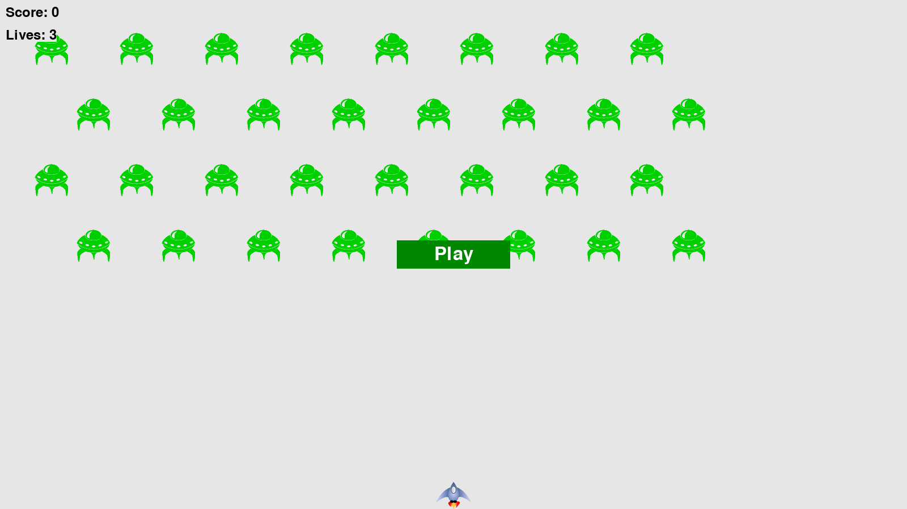
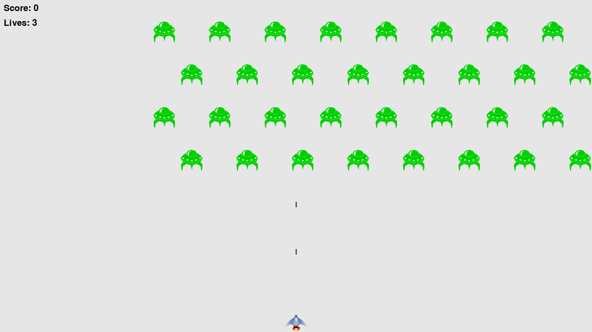
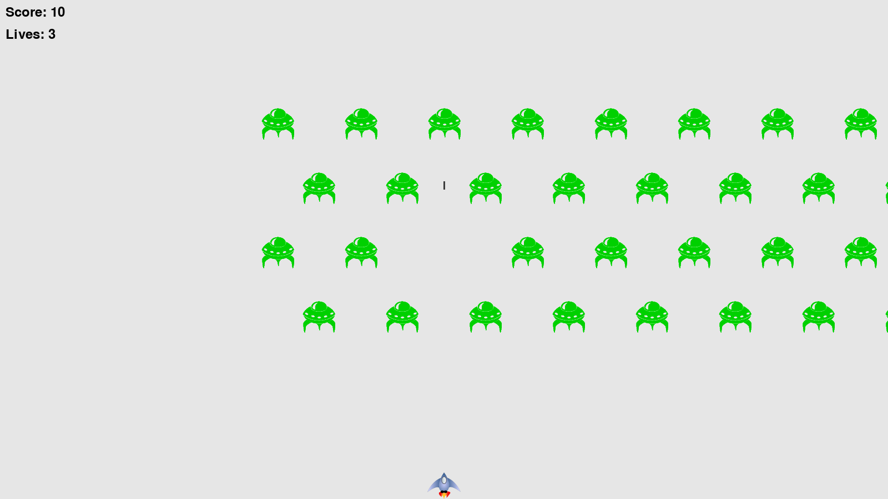

# 👾 Alien Invasion - Python Game 🎮

A classic arcade-style shooting game made using Python and Pygame, inspired by *Space Invaders*. Take control of a spaceship and defend Earth from an alien invasion!
---

## 🚀 Features

- Smooth 2D gameplay with sound effects
- Alien fleet movement and shooting mechanics
- Bullet firing system
- Interactive "Play" button to start the game
- Score and statistics tracking
- Easy to expand and modify

---

## 📁 Project Structure

Alien Invasion/ <br>
├── alien_invasion.py    # Main game loop <br>
├── settings.py          # Game settings <br>
├── ship.py              # Ship behavior <br>
├── bullet.py            # Bullet logic <br>
├── alien.py             # Alien logic <br>
├── button.py            # Play button <br>
├── game_stats.py        # Game statistics <br>
├── images/              # Store game sprites <br>
├── sfx/                 # Sound effects <br>
└── pycache/             # Auto-generated Python cache <br>


---

## 🛠️ Tech Stack

- **Python 3.12.7**
- **Pygame**

---

## ▶️ How to Run

1. Install dependencies:

   ```sh
   pip install pygame
   cd <Your Cloned Directory>
   python alien_invasion.py
   ```
2. That's it, Game is running now.... ENJOY!!!

---

## 🎮 Controls
    Left/Right Arrow Keys – Move ship
    Spacebar – Fire bullets
    Mouse Click – Play button

---

## 📸 Screenshots
</img>
</img>
</img>

---

## 📌 TODO / Upcoming Features
- High score saving
- Multiple levels
- Power-ups
- Background music

---

## 📬 Contact
Anshul Khaire <br>
📧 anshulamitkhaire@gmail.com <br>
🌐 [LinkedIn](https://www.linkedin.com/in/anshul-khaire-77732922a/) | [GitHub](https://github.com/anshul-dying)

---

## 📝 License
This project is open-source and available under the [MIT License](./LICENSE.txt).

### Feel Free to Expand this project
### You can use this as Python OOP project in your College also
### ⭐️ If you like this project, give it a star on GitHub!
